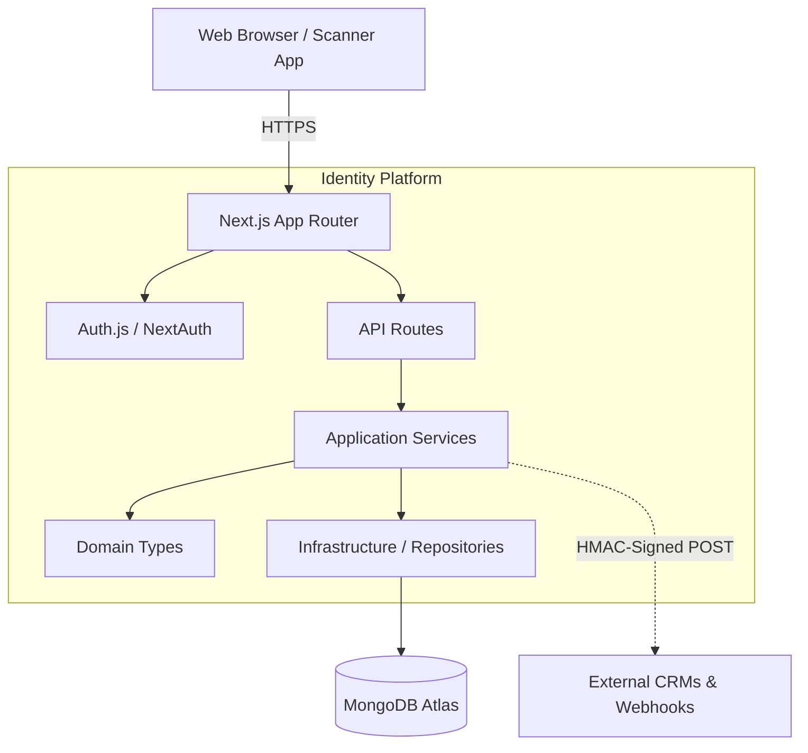

<div align="center">

# Identity — Enterprise Event Management Platform

**The complete attendee lifecycle platform. QR ticketing, live scanning, real-time analytics, and guest CRM in one production-grade SaaS.**

[](https://www.typescriptlang.org/)
[](https://nextjs.org/)
[](https://www.mongodb.com/)
[](./LICENSE)
[](./CONTRIBUTING.md)

[Demo](#) · [Docs](./docs/) · [Report Bug](https://github.com/ANUPAM4545/Qr-code-identify/issues) · [Request Feature](https://github.com/ANUPAM4545/Qr-code-identify/issues)

</div>

---

## Overview

**Identity** is a commercial-grade, multi-tenant SaaS platform for enterprise event management. It handles the complete attendee lifecycle — from public registration and CRM sync to live QR scanning and real-time analytics dashboards.

Built with a Clean Architecture pattern on Next.js 15 App Router, it is designed to scale from a 50-person private dinner to a 50,000-seat conference.

---

## ✨ Features

| Feature | Description |
|---|---|
| **Multi-Tenant Workspaces** | Isolated organizations with granular RBAC (Owner, Admin, Manager, Member, Viewer) |
| **Enterprise QR Studio** | Design-rich QR code engine with custom branding, gradients, and logo embedding |
| **Dynamic Form Builder** | Drag-and-drop registration forms with conditional logic and conversion analytics |
| **Guest CRM** | Unified attendee database tracking check-ins, VIP status, groups, and lifecycle events |
| **Live Scanning Engine** | Offline-capable QR scanner with automatic fallback sync for high-throughput gates |
| **Real-Time Analytics** | KPI dashboards with live metrics, timeline charts, and per-scanner performance |
| **Developer API & Webhooks** | API key management and HMAC-signed webhooks for Salesforce/HubSpot integrations |
| **Google OAuth + Email Auth** | Full Auth.js integration with account linking |
| **Smooth UX** | Lenis smooth scroll, Framer Motion animations, and a premium monochrome design system |

---

## Architecture

```
src/
├── app/                        # Next.js App Router
│   ├── api/                    # REST API Routes (typed, validated)
│   ├── (auth)/                 # Login / Register pages
│   ├── (dashboard)/            # Workspace & Event management UI
│   └── (event)/                # Per-event views (guests, scanner, analytics)
│
├── application/
│   └── services/               # Business Logic Layer (GuestService, QRService, etc.)
│
├── domain/
│   └── types.ts                # Canonical domain models
│
├── infrastructure/
│   ├── db.ts                   # MongoDB singleton client
│   └── repositories/           # Data Access Layer (MongoRepository base)
│
├── components/                 # Shared UI components
├── features/                   # Feature-scoped components (landing, scanner, etc.)
└── providers/                  # React context providers (Theme, Auth, QueryClient)
```



---

## Tech Stack

| Layer | Technology |
|---|---|
| **Framework** | Next.js 15 (App Router, Server Components) |
| **Language** | TypeScript 5 (strict mode) |
| **Styling** | Tailwind CSS v4 + Shadcn/ui |
| **Database** | MongoDB Atlas (native driver + aggregation pipelines) |
| **Authentication** | Auth.js v5 (Google OAuth + Credentials) |
| **Animations** | Framer Motion + Lenis smooth scroll |
| **Charts** | Recharts (via ChartAdapter abstraction layer) |
| **QR Generation** | `qr-code-styling` + `html5-qrcode` |
| **Tables** | TanStack Table v8 |
| **State Management** | TanStack Query v5 |
| **Deployment** | Vercel (Edge-optimized) |

---

## Getting Started

### Prerequisites
- Node.js 20+
- A MongoDB Atlas cluster (or local MongoDB)
- Google Cloud OAuth credentials

### 1. Clone the repository

```bash
git clone https://github.com/ANUPAM4545/Qr-code-identify.git
cd Qr-code-identify/Identify
npm install
```

### 2. Configure Environment Variables

Create `.env.local` in the project root:

```env
# MongoDB
MONGODB_URI="mongodb+srv://<user>:<password>@<cluster>.mongodb.net/<dbname>"

# Auth.js — generate with: openssl rand -base64 32
AUTH_SECRET="your-super-secure-random-secret"

# Google OAuth (from Google Cloud Console)
AUTH_GOOGLE_ID="your-google-oauth-client-id"
AUTH_GOOGLE_SECRET="your-google-oauth-client-secret"

# App URL
NEXT_PUBLIC_APP_URL="http://localhost:3000"
```

### 3. Run the Development Server

```bash
npm run dev
```

Navigate to [http://localhost:3000](http://localhost:3000).

---

## Deployment

This project is optimized for **Vercel** deployment.

1. Push to GitHub
2. Import the repo in [Vercel Dashboard](https://vercel.com/new)
3. Set the **Root Directory** to `Identify/`
4. Add the following Environment Variables in Vercel Project Settings:
   - `MONGODB_URI`
   - `AUTH_SECRET`
   - `AUTH_GOOGLE_ID`
   - `AUTH_GOOGLE_SECRET`
   - `NEXT_PUBLIC_APP_URL` (your Vercel deployment URL)

> **OAuth Callback**: Add `https://<your-domain>/api/auth/callback/google` to your Google Cloud OAuth authorized redirect URIs.

---

## Scripts

```bash
npm run dev       # Start development server (Turbopack)
npm run build     # Production build
npm run lint      # ESLint check
npm run typecheck # TypeScript strict check
```

---

## Contributing

Contributions are welcome! Please open an issue first to discuss your change before submitting a PR.

1. Fork the repository
2. Create your feature branch (`git checkout -b feat/amazing-feature`)
3. Commit your changes (`git commit -m 'feat: add amazing feature'`)
4. Push to the branch (`git push origin feat/amazing-feature`)
5. Open a Pull Request

---

## License

Copyright (c) 2026 Anupam. Released under the [MIT License](./LICENSE).
